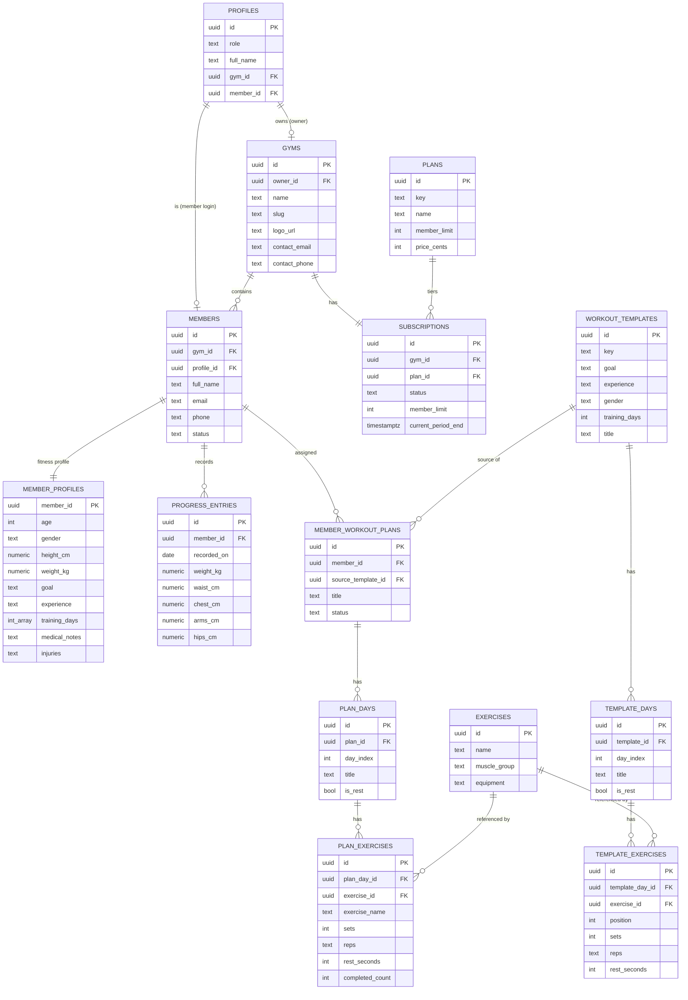

# GymPilot — Entity Relationship Diagram (Mermaid)

```mermaid
erDiagram
    PROFILES ||--o| GYMS : "owns (owner)"
    PROFILES ||--o| MEMBERS : "is (member login)"
    GYMS ||--|| SUBSCRIPTIONS : has
    PLANS ||--o{ SUBSCRIPTIONS : tiers
    GYMS ||--o{ MEMBERS : contains
    MEMBERS ||--|| MEMBER_PROFILES : "fitness profile"
    MEMBERS ||--o{ PROGRESS_ENTRIES : records
    MEMBERS ||--o{ MEMBER_WORKOUT_PLANS : assigned
    MEMBER_WORKOUT_PLANS ||--o{ PLAN_DAYS : has
    PLAN_DAYS ||--o{ PLAN_EXERCISES : has
    EXERCISES ||--o{ PLAN_EXERCISES : "referenced by"
    WORKOUT_TEMPLATES ||--o{ TEMPLATE_DAYS : has
    TEMPLATE_DAYS ||--o{ TEMPLATE_EXERCISES : has
    EXERCISES ||--o{ TEMPLATE_EXERCISES : "referenced by"
    WORKOUT_TEMPLATES ||--o{ MEMBER_WORKOUT_PLANS : "source of"

    PROFILES {
        uuid id PK
        text role
        text full_name
        uuid gym_id FK
        uuid member_id FK
    }
    PLANS {
        uuid id PK
        text key
        text name
        int member_limit
        int price_cents
    }
    GYMS {
        uuid id PK
        uuid owner_id FK
        text name
        text slug
        text logo_url
        text contact_email
        text contact_phone
    }
    SUBSCRIPTIONS {
        uuid id PK
        uuid gym_id FK
        uuid plan_id FK
        text status
        int member_limit
        timestamptz current_period_end
    }
    MEMBERS {
        uuid id PK
        uuid gym_id FK
        uuid profile_id FK
        text full_name
        text email
        text phone
        text status
    }
    MEMBER_PROFILES {
        uuid member_id PK
        int age
        text gender
        numeric height_cm
        numeric weight_kg
        text goal
        text experience
        int_array training_days
        text medical_notes
        text injuries
    }
    EXERCISES {
        uuid id PK
        text name
        text muscle_group
        text equipment
    }
    WORKOUT_TEMPLATES {
        uuid id PK
        text key
        text goal
        text experience
        text gender
        int training_days
        text title
    }
    TEMPLATE_DAYS {
        uuid id PK
        uuid template_id FK
        int day_index
        text title
        bool is_rest
    }
    TEMPLATE_EXERCISES {
        uuid id PK
        uuid template_day_id FK
        uuid exercise_id FK
        int position
        int sets
        text reps
        int rest_seconds
    }
    MEMBER_WORKOUT_PLANS {
        uuid id PK
        uuid member_id FK
        uuid source_template_id FK
        text title
        text status
    }
    PLAN_DAYS {
        uuid id PK
        uuid plan_id FK
        int day_index
        text title
        bool is_rest
    }
    PLAN_EXERCISES {
        uuid id PK
        uuid plan_day_id FK
        uuid exercise_id FK
        text exercise_name
        int sets
        text reps
        int rest_seconds
        int completed_count
    }
    PROGRESS_ENTRIES {
        uuid id PK
        uuid member_id FK
        date recorded_on
        numeric weight_kg
        numeric waist_cm
        numeric chest_cm
        numeric arms_cm
        numeric hips_cm
    }
```
